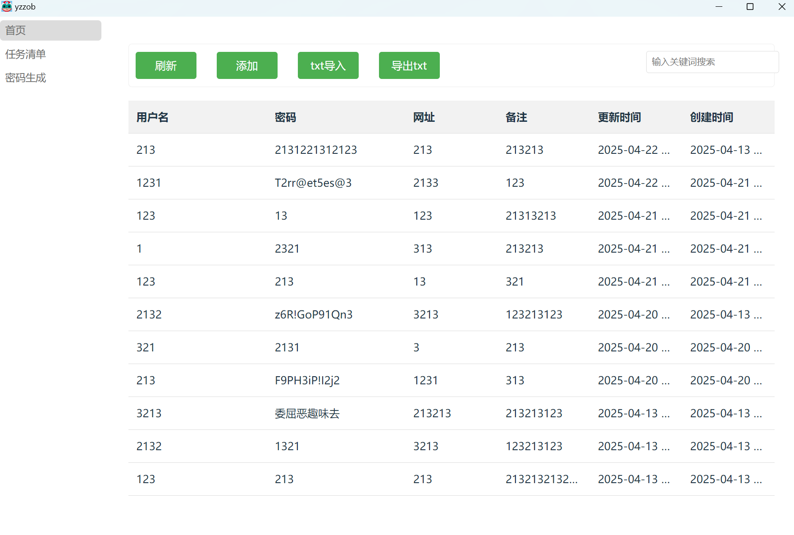

# password-management-tool

记录我electron的学习之旅

## 使用指南
### 源码运行
1. npm install
2. ./node_modules/.bin/electron-rebuild
3. npm run dev
### 安装包运行
windows通过release的mis

## 运行效果

## 更新日志
### 0422
添加双击和右键添加内容
添加底部提示栏

### 0421
通过修改forge.config.cjs和package.json
修复了打包错误的问题

### 0520
添加了鼠标悬浮,提示框显示格子内容
解决了Content Security Policy (CSP)产生的报错